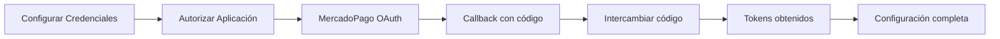
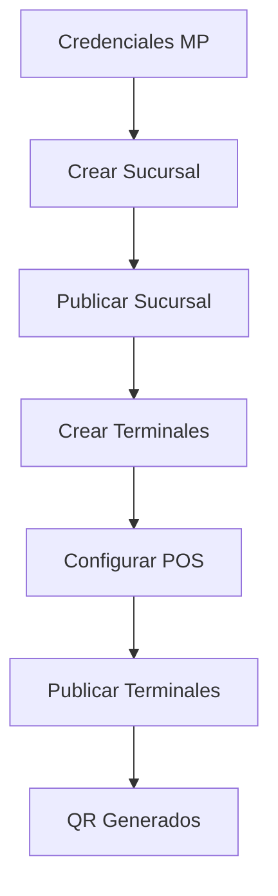
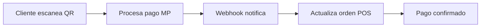

# Pos MercadoPago Base - Odoo 18

[](https://www.gnu.org/licenses/gpl-3.0)
[](https://github.com/axcelere)

## Descripción

**Pos MercadoPago Base** es un módulo de integración completa entre Odoo 18 y MercadoPago, diseñado para permitir pagos con tarjetas de crédito y débito en el punto de venta (POS). Desarrollado por Axcelere, este módulo proporciona una solución robusta y escalable para procesar transacciones de MercadoPago directamente desde Odoo.

## 🚀 Características Principales

### ✅ Autenticación OAuth 2.0
- **Flujo de autorización completo** con `authorization_code`
- **Gestión automática de tokens** con refresh automático
- **Configuración automática de redirect_uri** basada en el dominio de Odoo
- **Cron job automático** para renovar tokens próximos a expirar (5 días antes)

### ✅ Gestión de Sucursales (Stores)
- **Creación y actualización** de sucursales físicas en MercadoPago
- **Configuración de horarios comerciales** por día de la semana
- **Geolocalización** con coordenadas latitude/longitude
- **Sincronización bidireccional** con la plataforma MercadoPago

### ✅ Terminales POS (Store Boxes)
- **Configuración de terminales QR** para cada punto de venta
- **Vinculación con pos.config** de Odoo
- **Generación automática de códigos QR** para pagos
- **Gestión de estados** (Borrador/Publicado)

### ✅ Controles de Integridad
- **Constraints de eliminación** que previenen borrar configuraciones con sesiones POS activas
- **Eliminación en cascada** de terminales asociados
- **Validaciones de sesiones** para mantener consistencia operacional

### ✅ Logs y Notificaciones
- **Sistema de logs** para auditoría y debugging
- **Webhooks** para notificaciones de MercadoPago
- **Controladores especializados** para manejo de callbacks OAuth

## 📁 Estructura del Módulo

```
pos_mercadopago/
├── __init__.py                     # Inicialización del módulo
├── __manifest__.py                 # Metadatos y dependencias
├── README.md                       # Documentación (este archivo)
├── controllers/
│   ├── __init__.py
│   ├── mp_oauth_controller.py      # Controlador OAuth y callbacks
│   └── webhook.py                  # Webhooks de MercadoPago
├── data/
│   └── cron_jobs.xml              # Jobs automáticos (refresh tokens)
├── models/
│   ├── __init__.py
│   ├── mp_credential.py           # Credenciales y OAuth
│   ├── mp_store.py                # Sucursales físicas
│   ├── mp_store_box.py            # Terminales POS
│   ├── mp_log.py                  # Logs del sistema
│   ├── mp_notifications.py       # Notificaciones
│   ├── pos_config.py              # Extensiones pos.config
│   └── pos_payment_method.py      # Métodos de pago
├── security/
│   └── ir.model.access.csv        # Control de accesos
└── views/
    ├── mp_credential_views.xml    # Vistas de credenciales
    ├── mp_store_views.xml         # Vistas de sucursales
    ├── mp_store_box_views.xml     # Vistas de terminales
    ├── mp_log_views.xml           # Vistas de logs
    └── mp_notification_views.xml  # Vistas de notificaciones
```

## 🛠️ Instalación

### Requisitos Previos
- Odoo 18.0
- Módulo `point_of_sale` instalado
- Cuenta de desarrollador en MercadoPago
- Aplicación configurada en MercadoPago Developers

### Pasos de Instalación

1. **Clonar o copiar el módulo** en tu directorio de addons:
```bash
cp -r pos_mercadopago /path/to/odoo/addons/
```

2. **Actualizar lista de módulos** en Odoo:
```
Configuración > Módulos > Actualizar Lista de Aplicaciones
```

3. **Instalar el módulo**:
```
Buscar "Pos MP Base" > Instalar
```

## ⚙️ Configuración

### 1. Configuración en MercadoPago

1. **Acceder a MercadoPago Developers**:
   - Ir a: https://www.mercadopago.com/developers/
   - Crear o seleccionar tu aplicación

2. **Configurar URLs de redirección**:
   ```
   https://tu-dominio-odoo.com/mercadopago/oauth/callback
   ```

3. **Obtener credenciales**:
   - `Client ID` (APP_ID)
   - `Client Secret`

### 2. Configuración en Odoo

#### Paso 1: Crear Credencial MP
```
Punto de Venta > Configuración > MP > Credenciales > Crear
```

**Campos requeridos:**
- **Name**: Nombre descriptivo
- **MP URL**: `https://api.mercadopago.com` (por defecto)
- **Platform ID**: ID de plataforma MercadoPago
- **Integrator ID**: ID del integrador
- **Client ID**: Obtenido de MercadoPago Developers
- **Client Secret**: Obtenido de MercadoPago Developers
- **Redirect URI**: Se completa automáticamente con tu dominio

#### Paso 2: Proceso OAuth
1. **Completar configuración básica** y guardar
2. **Clic en "1. Autorizar Aplicación"**:
   - Se abrirá ventana de MercadoPago
   - Autorizar la aplicación
   - La ventana se cerrará automáticamente

3. **Clic en "2. Intercambiar Código"**:
   - Se procesará el código de autorización
   - Se obtendrán los tokens (access_token, refresh_token, public_key)

#### Paso 3: Crear Sucursal (Store)
```
Punto de Venta > Configuración > MP > Sucursales > Crear
```

**Configuración de sucursal:**
- **Información básica**: Nombre, dirección, coordenadas
- **Horarios comerciales**: Configurar por día de la semana
- **Geolocalización**: Latitude y Longitude (opcional)

**Publicar sucursal:**
- Clic en "Publicar" para sincronizar con MercadoPago

#### Paso 4: Configurar Terminales (Store Boxes)
```
Punto de Venta > Configuración > MP > Terminales > Crear
```

**Configuración de terminal:**
- **Sucursal física**: Seleccionar sucursal creada
- **Terminales**: Agregar líneas para cada pos.config
- **Configuración**: Código MCC, montos fijos, etc.

**Publicar terminales:**
- Clic en "Publicar" para generar códigos QR

## 🔄 Flujo de Trabajo

### Flujo OAuth (Automático)


### Flujo de Configuración


### Flujo de Pago


## 🔧 Características Técnicas

### Autenticación OAuth 2.0
- **Grant Type**: `authorization_code` para tokens completos
- **Refresh automático**: Cron job diario que renueva tokens próximos a expirar
- **Seguridad**: Validación de `state` parameter para prevenir CSRF

### Gestión de Tokens
```python
# El sistema maneja automáticamente:
{
    "access_token": "APP_USR-...",
    "token_type": "Bearer",
    "expires_in": 15552000,
    "refresh_token": "TG-...",
    "public_key": "APP_USR-...",
    "live_mode": true
}
```

### Constraints de Seguridad
- **Prevención de eliminación**: No permite borrar terminales con sesiones POS activas
- **Eliminación en cascada**: Elimina automáticamente elementos dependientes
- **Validación de estados**: Verifica consistency antes de operaciones críticas

## 📊 Modelos de Datos

### mp.credential
- **Gestión de credenciales** y tokens OAuth
- **Configuración de endpoints** MercadoPago
- **Refresh automático** de tokens

### mp.store
- **Sucursales físicas** sincronizadas con MercadoPago
- **Horarios comerciales** configurables
- **Información geográfica** y de contacto

### mp.store.box
- **Terminales POS** para generación de QR
- **Vinculación con pos.config** de Odoo
- **Estados de publicación**

### mp.store.box.line
- **Líneas de terminal** individuales
- **Configuración específica** por punto de venta
- **Generación de códigos QR**

## 🔄 Cron Jobs

### Refresh de Tokens OAuth
- **Frecuencia**: Diario (cada 24 horas)
- **Función**: Renueva tokens próximos a expirar (5 días antes)
- **Logging**: Registra actividad y errores
- **Estado**: Activo por defecto

## 🐛 Debugging y Logs

### Sistema de Logs
```python
# Los logs se almacenan en:
_logger = logging.getLogger(__name__)

# Niveles utilizados:
_logger.info("Operación exitosa")
_logger.error("Error en operación")
```

### Webhooks
- **Endpoint**: `/mercadopago/webhook`
- **Autenticación**: Validación de firma MercadoPago
- **Procesamiento**: Asíncrono para mejor rendimiento

## ⚠️ Limitaciones y Consideraciones

### Limitaciones Actuales
- **Una credencial por compañía**: Sistema diseñado para una integración MP por empresa
- **QR estático**: Los códigos QR son para pagos únicos (no reutilizables)
- **Moneda única**: Configurado para la moneda de la compañía

### Consideraciones de Seguridad
- **Tokens sensibles**: Almacenados con campo `password=True`
- **Validación HTTPS**: Recomendado para producción
- **Backup de credenciales**: Incluir en respaldos regulares

## 🤝 Contribución

Este módulo ha sido desarrollado por **Axcelere** (https://www.axcelere.com).

### Estructura de Commits
```
[ADD][pos_mercadopago]: Descripción de nueva funcionalidad
[FIX][pos_mercadopago]: Descripción de corrección
[REFACTOR][pos_mercadopago]: Descripción de refactorización
```

## 📞 Soporte

Para soporte técnico y consultas:
- **Website**: https://www.axcelere.com
- **Email**: Consultar website oficial

## 📜 Licencia

Este módulo está licenciado bajo **GPL-3.0**. Ver el archivo LICENSE para más detalles.

---

**Desarrollado por Axcelere**