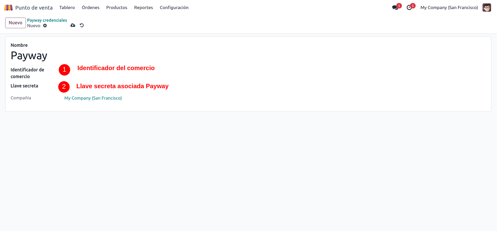
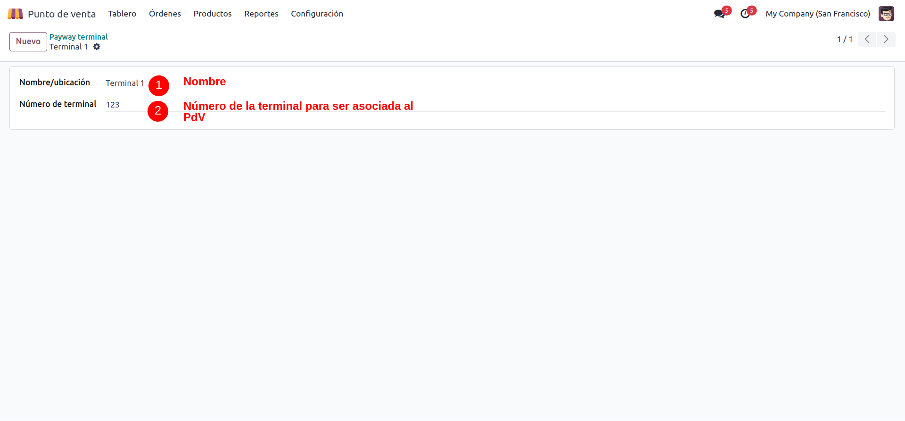
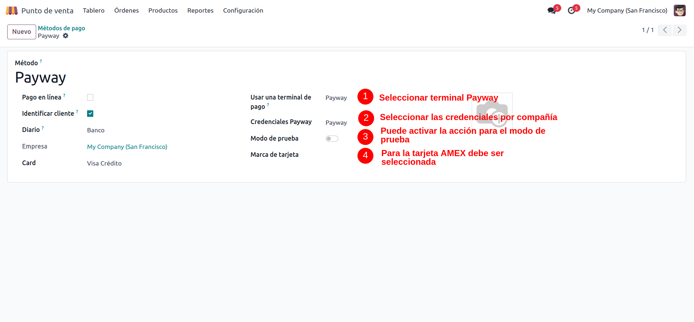
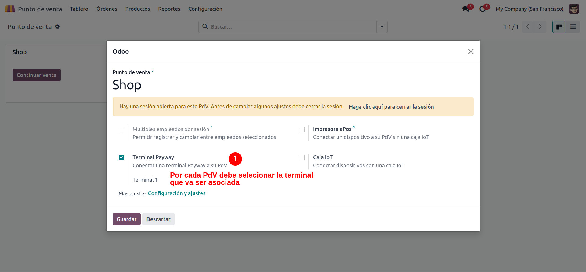
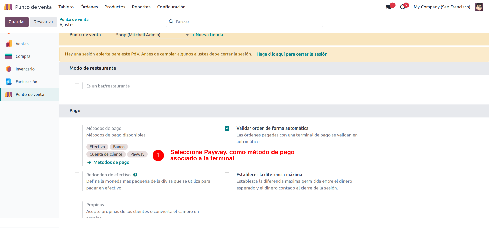
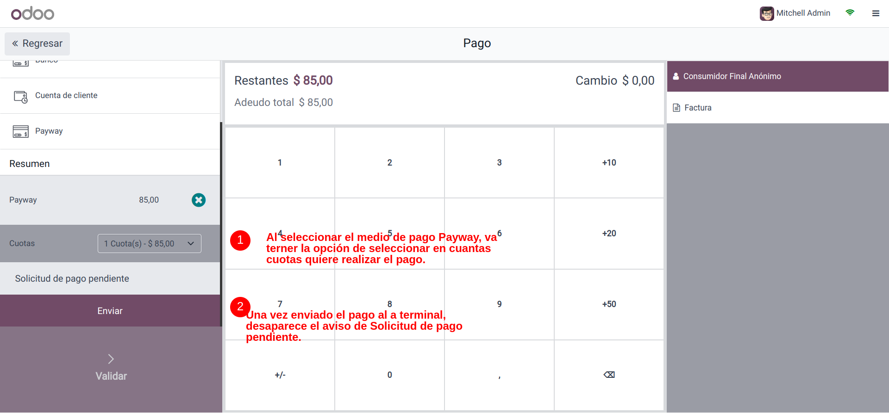
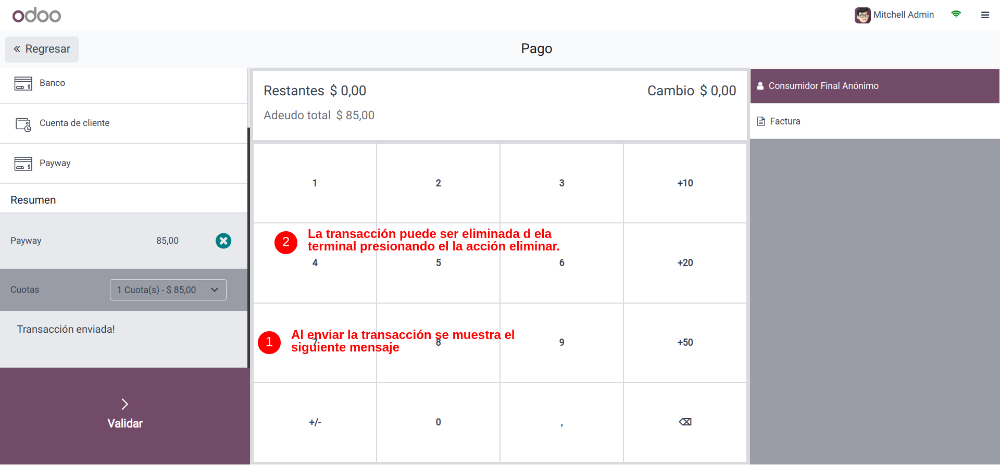
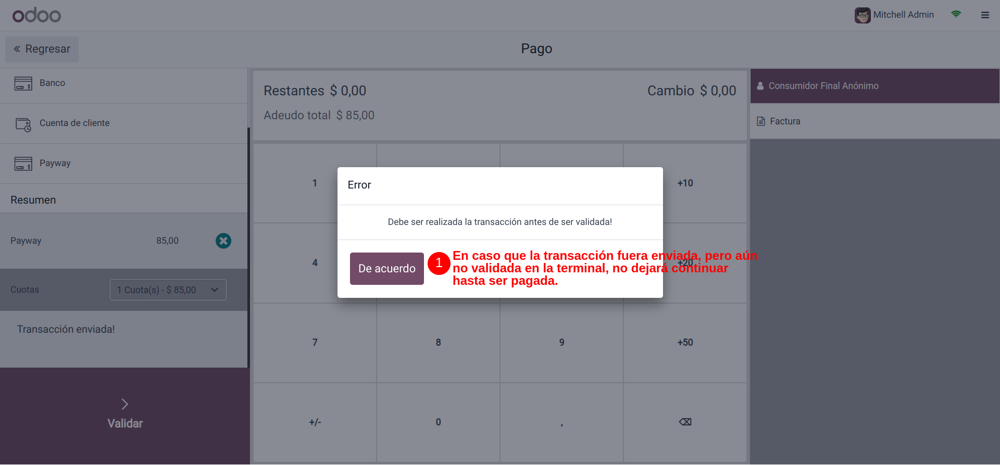

# POS PayWay

Integrate your POS with a PayWay payment terminal.

## Configuration

### Setting Up Payment Method

- Navigate to *Point of Sale > Configuration > Payway credential*.
    
- Navigate to *Point of Sale > Configuration > Payway terminal*.
  
- Create a new payment method.
- Select *Payway* from the list of available payment terminals.
- Enter your Payway credentials.
- Navigate to *Point of Sale > Configuration > Payment method*.
  

Note: Set *Payway Mode* as demo if you only want to make payments in the test environment.
- Navigate to *Point of Sale > Dashboard > Select some Point of Sale and edit > Select terminal*.
  

### Enabling the Payment Method

- Activate the Payway payment method for each point of sale where it will be utilized.

- Access *Point of Sale > Configuration > Settings*.

## Usage

### Using the payway Payment Method

- At the point of sale interface, select the items for purchase.
- When ready to make a payment, choose the Payway payment method.
- A button will appear allowing you to send the transaction to the Payway payment terminal.
- Complete the transaction on the Payway terminal as necessary.

## Known issues

This module has been tested exclusively with the Payway payment terminal.

## Credits

### Authors

- Axcelere

### Contributors

- Ernesto Mato Roque <<ernesto@axcelere.com>>
