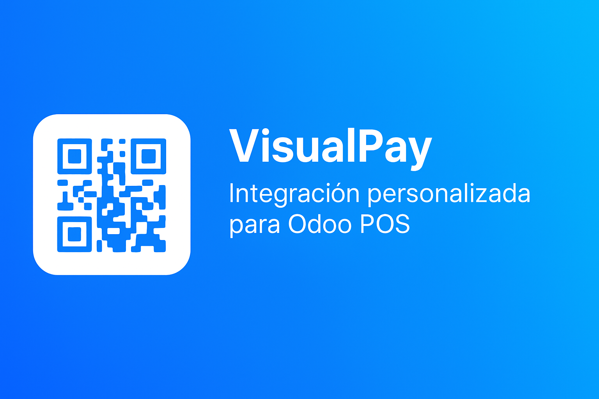
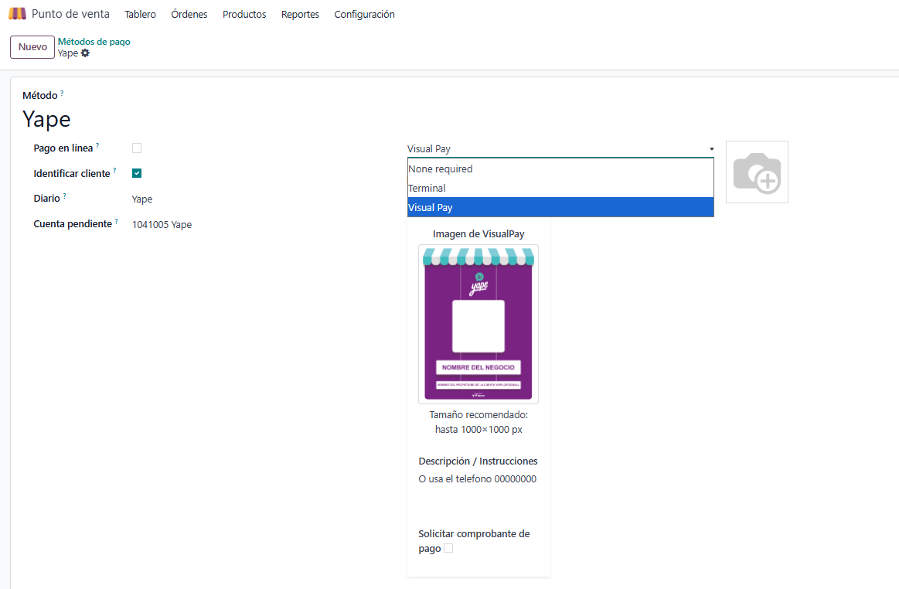
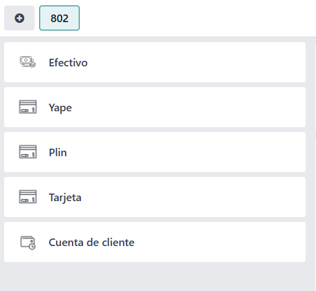
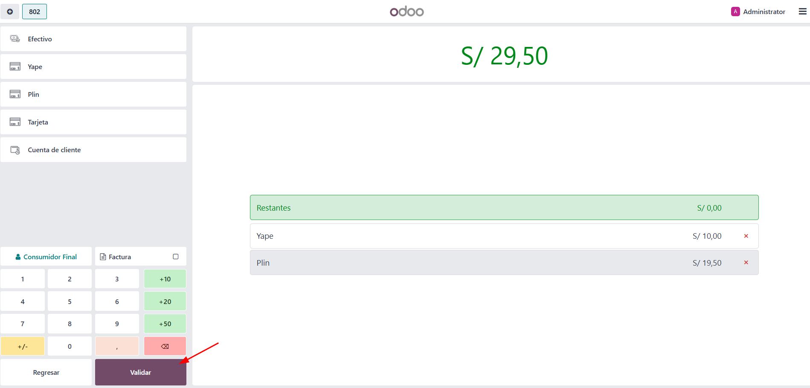
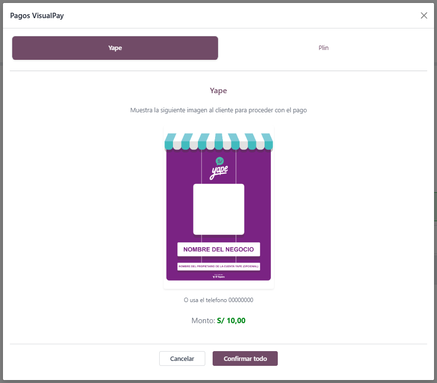
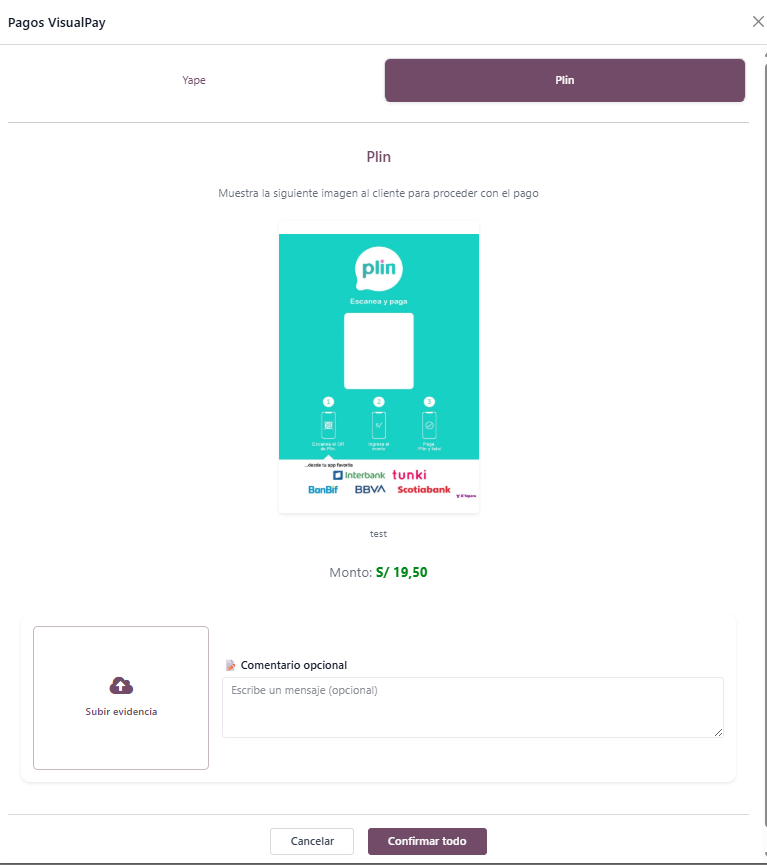
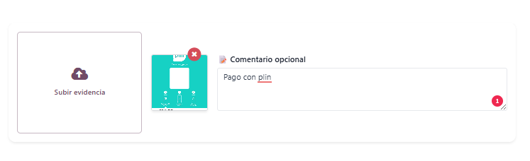
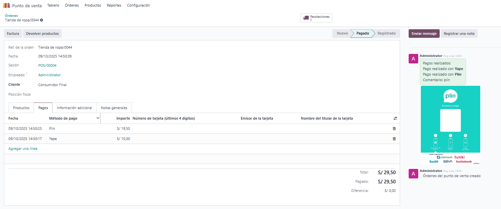

# VisualPay POS Integration

## 💡 Overview
**VisualPay** integra pagos visuales en el Punto de Venta de Odoo, permitiendo mostrar códigos QR, imágenes y solicitar confirmaciones de pago directamente desde el flujo POS.  
Su diseño es limpio, intuitivo y se integra sin complicaciones con los métodos de pago existentes.

---
🔗 Disponible en Odoo Apps: https://apps.odoo.com/apps/modules/18.0/pos_visualpay

---

## 🚀 Feature Highlights

| Característica | Descripción |
|----------------|--------------|
| 🧩 **Visual Payment Integration** | Permite agregar métodos de pago con imagen QR directamente en el POS. |
| 🖼️ **QR / Image Upload** | Sube cualquier imagen o código QR del método de pago a mostrar en pantalla. |
| 💬 **Description & Instructions** | Agrega mensajes personalizados que aparecerán al procesar el pago. |
| ✅ **Payment Confirmation** | Opción para solicitar comprobante de pago visual antes de validar la orden. |
| 💻 **Seamless POS Integration** | Totalmente integrado en la vista de configuración de métodos de pago del POS. |
| 📱 **Responsive Design** | Diseñado con Bootstrap para adaptarse perfectamente a escritorio y móvil. |

---

## 🧭 How It Works

### Step 1: Configuración de VisualPay
En los métodos de pago del POS, selecciona **VisualPay** e ingresa los detalles requeridos.  

### Step 2: Visualización en métodos de pago
Los métodos VisualPay aparecen como cualquier otro método estándar dentro del POS.  

### Step 3: Validación de pagos
Tras agregar los métodos de pago al pedido, se procede con la validación normal del POS.  

### Step 4: Ventana de confirmación sin comprobante
Si el método no requiere comprobante, simplemente muestra la línea de pago correspondiente.  

### Step 5: Ventana de confirmación con comprobante
Cuando la opción de confirmación está activa, se solicita subir la imagen del pago.  

### Step 6: Agregar comentario
Permite añadir una nota o comentario junto con la imagen cargada del comprobante.  

### Step 7: Confirmación registrada en el chat
Una vez validada la orden, la imagen y los comentarios se añaden al historial del pedido.  

---

## 🤝 Support & Contact

### 🐛 Report Issues
Si encontraste un bug o error en el módulo, repórtalo directamente en nuestro repositorio:  
🔗 [Abrir un Issue](https://github.com/EpOpenLabs/Odoo-Open/issues)

### 💡 Feature Requests
¿Tienes una idea o mejora para VisualPay? Cuéntanos y podríamos incluirla en próximas versiones.  
🔗 [Enviar sugerencia](https://github.com/EpOpenLabs/Odoo-Open/issues)

### ✉️ General Contact
Para consultas o soporte general, puedes escribirnos directamente:  
📩 [lpachecoby@gmail.com](mailto:lpachecoby@gmail.com)

---

❤️ **Desarrollado por Ernesto Pacheco**  
Código abierto disponible en [GitHub](https://github.com/EpOpenLabs/Odoo-Open)
