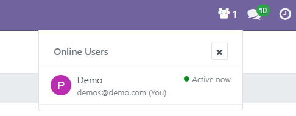

# Simple Online Users - Free Edition

A lightweight Odoo module that displays the count of currently online users in the systray.

## Features

- **Real-time Online Count**: See how many users are currently active
- **User Status Popup**: Click to view detailed list with user status
- **Native Integration**: Uses Odoo's built-in `bus.presence` system
- **Configurable Visibility**: Control who can see the online users count
- **Lightweight**: No custom models or heavy resource usage
- **Status Detection**: Automatic online/away/offline status detection

## Installation

1. Download the module to your Odoo addons directory
2. Update the app list in your Odoo instance
3. Install "Simple Online Users" from the Apps menu
4. The online users count will appear automatically in your systray

## Configuration

Configure visibility permissions in:
**Settings → General Settings → Online Users**

Available visibility options:
- System Administrators only
- Internal Users  
- Portal Users (all users)

## Usage

- The online users count appears in the systray (top right)
- Click the count to see a popup with detailed user list
- Users are shown with their status (online/away/offline) and last activity
- The count updates automatically every 30 seconds

## Technical Details

- **Dependencies**: `base`, `web`, `bus`
- **Compatibility**: Odoo 17.0+
- **License**: LGPL-3
- **Status Detection**:
  - Online: Last activity < 1 minute
  - Away: Last activity 1-3 minutes  
  - Offline: Last activity > 3 minutes

